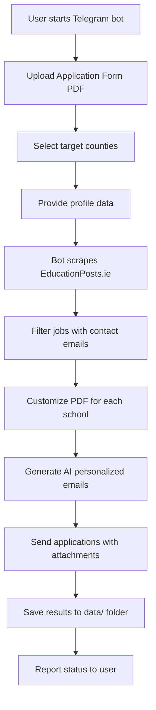

# ScrapingProfesNomadas 🌍📚

[](https://www.python.org/downloads/)
[](LICENSE)

Automated job application system for nomadic teachers seeking positions in Ireland. This project scrapes teaching job offers from EducationPosts.ie, personalizes application forms, and sends customized emails to schools - all managed through an interactive Telegram bot.

## ✨ Features

- 🤖 **Interactive Telegram Bot** - Easy-to-use conversational interface for managing job applications
- 🔍 **Smart Job Scraping** - Automated scraping of teaching positions from EducationPosts.ie
- 📍 **Geographic Filtering** - Target specific counties (Cork, Dublin) or search all of Ireland
- 📝 **PDF Form Customization** - Automatically fills application forms with your data
- ✉️ **AI-Powered Emails** - Generates personalized cover emails using AI (OpenAI/Anthropic)
- 📧 **Bulk Email Sending** - Send applications to multiple schools with one command
- 📊 **Excel Profile Support** - Import candidate profiles from Excel for mass applications
- 🔐 **Secure Authentication** - User authorization system for bot access
- 📁 **Document Management** - Handles CVs, certificates, and other attachments
- 🌐 **Resend Integration** - Professional email delivery with Resend API

## 🏗️ Project Structure

```
ScrapingProfesNomadas/
├── src/                          # Main application code
│   ├── bots/                     # Telegram bot implementation
│   ├── scrapers/                 # EducationPosts scraper
│   ├── generators/               # Email and PDF generation
│   └── utils/                    # Helper utilities (logging, Firebase, etc.)
├── scripts/                      # Orchestration scripts
│   ├── scrape_all_safe.py       # Main scraping workflow
│   └── send_presentation_to_schools.py  # School presentation mailer
├── tests/                        # Test suite
├── templates/                    # Email templates
├── data/                         # Job offers and outputs
├── logs/                         # Application logs
├── config/                       # Configuration files
├── run.py                        # Main entry point
└── requirements.txt              # Python dependencies
```

## 🚀 Quick Start

### Prerequisites

- Python 3.8 or higher
- pip (Python package manager)
- Telegram account
- EducationPosts.ie account
- (Optional) Resend API key for email sending
- (Optional) OpenAI or Anthropic API key for AI email generation

### Installation

1. **Clone the repository**
   ```bash
   git clone https://github.com/yourusername/ScrapingProfesNomadas.git
   cd ScrapingProfesNomadas
   ```

2. **Create a virtual environment**
   ```bash
   python3 -m venv .venv
   source .venv/bin/activate  # On Windows: .venv\Scripts\activate
   ```

3. **Install dependencies**
   ```bash
   pip install -r requirements.txt
   python -m playwright install  # Install browser drivers
   ```

4. **Configure environment variables**
   
   Create a `.env` file in the project root:
   ```env
   # Telegram Bot
   TELEGRAM_BOT_TOKEN=your_telegram_bot_token
   AUTHORIZED_USER_IDS=123456789,987654321  # Comma-separated user IDs
   
   # EducationPosts Credentials
   EDUCATIONPOSTS_USERNAME=your_username
   EDUCATIONPOSTS_PASSWORD=your_password
   
   # Email Configuration (Resend)
   RESEND_API_KEY=your_resend_api_key
   RESEND_FROM_EMAIL=noreply@yourdomain.com
   
   # AI Email Generation (Optional)
   OPENAI_API_KEY=your_openai_key
   ANTHROPIC_API_KEY=your_anthropic_key
   
   # Firebase (Optional - for document storage)
   GOOGLE_APPLICATION_CREDENTIALS=path/to/service-account.json
   FIREBASE_STORAGE_BUCKET=your-bucket.appspot.com
   
   # Testing
   EMAIL_ADDRESS=test@example.com  # For test emails
   ```

5. **Run the setup script**
   ```bash
   python setup.py
   ```

### Usage

#### Start the Telegram Bot

```bash
python run.py
```

The bot will start and wait for commands on Telegram. Message your bot to begin!

#### Bot Commands

- `/start` - Initialize the bot and begin the application flow
- Upload your **Application Form PDF** when prompted
- Select target counties (Cork, Dublin, Both, or All Ireland)
- Provide your profile information
- Review and confirm before sending applications

#### Run Scraper Directly (Without Bot)

```bash
python scripts/scrape_all_safe.py
```

## 📖 How It Works



### Scraping Flow

1. **Authentication** - Logs into EducationPosts.ie using Playwright
2. **Job Discovery** - Navigates to primary teaching jobs filtered by county
3. **Data Extraction** - Parses school name, position, email, roll number, etc.
4. **PDF Customization** - Fills your template PDF with school-specific data
5. **Email Generation** - Creates personalized cover emails using AI
6. **Delivery** - Sends emails with customized PDFs via Resend API

### County Selection

- **Cork** - Jobs in Cork county only
- **Dublin** - Jobs in Dublin county only
- **Both** - Combined Cork + Dublin search
- **All Ireland** - Nationwide search

## 🛠️ Development

### Running Tests

```bash
# Run all tests
pytest

# Run specific test file
pytest tests/test_pdf_generation.py

# Verbose output
pytest -v
```

### Code Quality

The project follows:
- **PEP 8** style guide
- **snake_case** for functions and variables
- **CamelCase** for classes
- **UPPER_CASE** for constants
- Type hints where applicable
- Comprehensive logging (no `print()` statements in library code)

### Adding New Features

1. Create a new branch: `git checkout -b feature/your-feature`
2. Make your changes following the coding conventions
3. Add tests for new functionality
4. Update documentation
5. Submit a pull request

## 📂 Key Files

- [`run.py`](file:///Users/raulfortea/Projects/ScrapingProfesNomadas/run.py) - Main entry point
- [`scripts/scrape_all_safe.py`](file:///Users/raulfortea/Projects/ScrapingProfesNomadas/scripts/scrape_all_safe.py) - Core scraping logic
- [`src/scrapers/scraper_educationposts.py`](file:///Users/raulfortea/Projects/ScrapingProfesNomadas/src/scrapers/) - EducationPosts scraper
- [`src/bots/telegram_bot.py`](file:///Users/raulfortea/Projects/ScrapingProfesNomadas/src/bots/) - Telegram bot implementation
- [`src/generators/email_sender.py`](file:///Users/raulfortea/Projects/ScrapingProfesNomadas/src/generators/) - Email delivery system
- [`src/generators/ai_email_generator_v2.py`](file:///Users/raulfortea/Projects/ScrapingProfesNomadas/src/generators/) - AI email generation

## 🔐 Security

- **Never commit** `.env` files or credentials
- Use environment variables for all sensitive data
- User IDs are validated against authorized list
- Firebase service accounts should be gitignored
- All credentials are loaded via `python-dotenv`

## 🐛 Troubleshooting

### Bot doesn't respond
- Check `TELEGRAM_BOT_TOKEN` is correct
- Verify your Telegram user ID is in `AUTHORIZED_USER_IDS`
- Check logs in `logs/` directory

### Scraper fails
- Verify EducationPosts credentials in `.env`
- Ensure Playwright browsers are installed: `python -m playwright install`
- Check internet connection and EducationPosts.ie availability

### Email sending fails
- Verify `RESEND_API_KEY` is valid
- Ensure `RESEND_FROM_EMAIL` is verified in Resend dashboard
- Check email format and attachments

### PDF customization errors
- Ensure your Application Form PDF is a valid PDF file
- Check PDF is not password-protected or corrupted
- Review logs for specific PDF processing errors

## 📊 Output Files

All generated files are saved to:
- `data/ofertas_*.json` - Job scraping results with metadata
- `logs/scraping_bot_*.log` - Detailed execution logs
- `temp/application_forms/` - Generated customized PDFs (deleted after sending)

## 🤝 Contributing

Contributions are welcome! Please:
1. Fork the repository
2. Create a feature branch
3. Follow the coding style guide (see [`AGENTS.md`](file:///Users/raulfortea/Projects/ScrapingProfesNomadas/AGENTS.md))
4. Add tests for new features
5. Update documentation
6. Submit a pull request

## 📄 License

This project is licensed under the MIT License - see the LICENSE file for details.

## 🙏 Acknowledgments

- Built for nomadic teachers seeking opportunities in Ireland
- Uses Playwright for robust web scraping
- Powered by Resend for reliable email delivery
- AI email generation via OpenAI and Anthropic

## 📞 Support

For issues, questions, or contributions:
- Open an issue on GitHub
- Check existing documentation in `docs/`
- Review `AGENTS.md` for development guidelines

---

**Made with ❤️ for nomadic educators**
